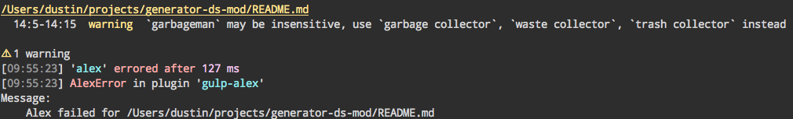

# gulp-alex
[](https://badge.fury.io/js/gulp-alex) [](https://travis-ci.org/dustinspecker/gulp-alex) [](https://coveralls.io/r/dustinspecker/gulp-alex?branch=master)

[](https://codeclimate.com/github/dustinspecker/gulp-alex) [](https://david-dm.org/dustinspecker/gulp-alex/#info=dependencies&view=table) [](https://david-dm.org/dustinspecker/gulp-alex/#info=devDependencies&view=table)

> Gulp plugin for [Alex](https://github.com/wooorm/alex)

## Install
```
npm install --save-dev gulp-alex
```

## Usage
### ES2015
```javascript
// gulpfile.babel.js
import alex from 'gulp-alex';
import gulp from 'gulp';

/* ./README.md */
// # Awesome project!
// Garbagemen versus Abe Lincoln!
gulp.task('alex', () => {
  return gulp.src('./README.md')
    .pipe(alex());
});
// `gulp alex` produces in console:
// README.md
//   2:1 `garbageman` may be insensitive, use `garbage collector`, `waste collector`, `trash collector` instead
```



### ES5
```javascript
// gulpfile.js
var alex = require('gulp-alex');
var gulp = require('gulp');

/* ./README.md */
// # Awesome project!
// Garbagemen versus Abe Lincoln!
gulp.task('alex', function () {
  return gulp.src('./README.md')
    .pipe(alex());
});
// `gulp alex` produces in console:
// README.md
//   2:1 `garbageman` may be insensitive, use `garbage collector`, `waste collector`, `trash collector` instead
```

## Options

Supports all options supported by [vfile-reporter](https://github.com/wooorm/vfile-reporter#reportervfiles-options).

Additionally, supports a `fail` option. When Alex encounters a warning or fatal reason, gulp-alex wiill emit an error if `fail` is `true`. The default value is `false`.

```javascript
gulp.task('alex', function () {
  return gulp.src('./README.md')
    .pipe(alex({fail: true}));
});
```

## LICENSE
MIT © [Dustin Specker](https://github.com/dustinspecker)